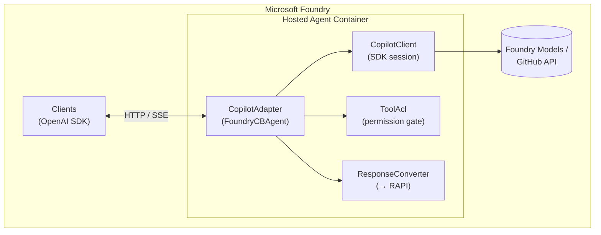
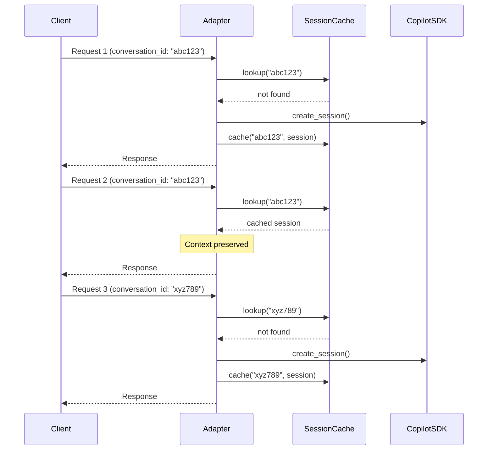
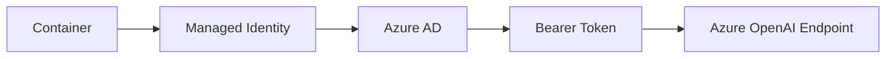
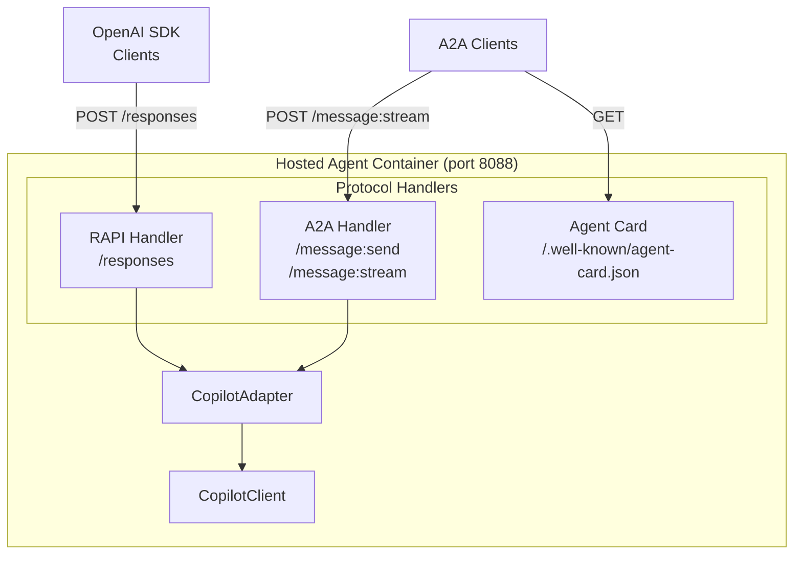
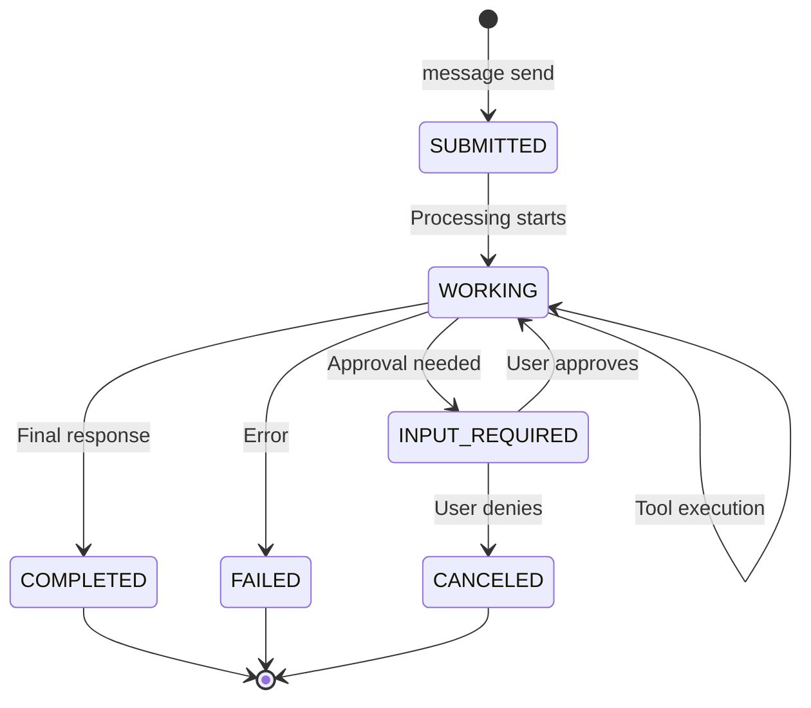

# Copilot SDK Adapter — Architecture Overview

This document provides a high-level technical overview of the GitHub Copilot
SDK adapter for Microsoft Foundry Agent Server.  For detailed streaming protocol
implementation, see [DESIGN.md](DESIGN.md).

## Executive Summary

The Copilot adapter enables GitHub Copilot's AI capabilities — including tool
execution, multi-turn conversations, and code understanding — to be deployed
as a **hosted agent** on Microsoft Foundry.  Clients interact using the
standard OpenAI Responses API; the adapter translates between the two
protocols transparently.



---

## Key Components

### 1. CopilotAdapter

The central orchestrator that bridges the OpenAI Responses API to the Copilot
SDK.  It:

- Receives RAPI requests (JSON or streaming)
- Converts them to Copilot `MessageOptions`
- Manages Copilot sessions per conversation
- Evaluates tool permission requests against the ACL
- Converts Copilot events back to RAPI streaming events
- Emits OpenTelemetry traces for observability

```python
from azure.ai.agentserver.copilot import from_copilot

agent = from_copilot(acl_path="/app/tools_acl.yaml")
await agent.run_async()  # starts HTTP server on :8088
```

### 2. Tool Access Control List (ToolAcl)

A YAML-based security layer that gates every tool invocation before execution.
When Copilot wants to run a shell command, read a file, fetch a URL, or invoke
an MCP tool, the adapter consults the ACL rules **before** allowing it.

**Rule evaluation:**
1. Rules are checked in declaration order
2. First matching rule's action (`allow` / `deny`) is applied
3. If no rule matches, `default_action` applies (default: `deny`)

**Example ACL (tools_acl.yaml):**

```yaml
version: "1"
default_action: deny

rules:
  # Block dangerous shell commands
  - kind: shell
    action: deny
    when:
      command: "\\brm\\b|\\bsudo\\b|\\bchmod\\b"

  # Allow safe shell commands
  - kind: shell
    action: allow
    when:
      command: "^(ls|cat|head|tail|grep|find|echo|pwd|python)"

  # Allow reading only safe directories
  - kind: read
    action: allow
    when:
      path: "^(/tmp/|/home/app/|/workspace/)"

  # Block URL fetches to untrusted domains
  - kind: url
    action: allow
    when:
      url: "^https://(.*\\.)?(microsoft|github|python)\\.com/"
```

**Permission request kinds:**

| Kind | Description | Key fields |
|------|-------------|------------|
| `shell` | Execute shell commands | `fullCommandText`, `commands[]` |
| `read` | Read files or directories | `path` |
| `write` | Write or modify files | `fileName`, `diff` |
| `url` | Fetch HTTP/HTTPS URLs | `url` |
| `mcp` | Invoke MCP server tools | `toolName`, `serverName` |

### 3. Session Management

The adapter maintains **persistent Copilot sessions** for multi-turn
conversations.  This preserves context (memory, tool state, conversation
history) across multiple requests.



Session mapping is keyed by the `conversation_id` from the RAPI request.
Sessions without a conversation ID are ephemeral (not cached).

### 4. Response Conversion

The `CopilotStreamingResponseConverter` translates Copilot SDK events into
RAPI Server-Sent Events.  The mapping follows strict ordering guarantees
from the Copilot SDK:

| Copilot Event | RAPI Events |
|---------------|-------------|
| `ASSISTANT_TURN_START` | `response.created`, `response.in_progress`, `response.output_item.added`, `response.content_part.added` |
| `ASSISTANT_MESSAGE_DELTA` | `response.output_text.delta` |
| `ASSISTANT_USAGE` | *(stored for completion)* |
| `ASSISTANT_MESSAGE` | *(triggers done-event chain)* |
| `ASSISTANT_TURN_END` | `response.output_text.done`, `response.content_part.done`, `response.output_item.done`, `response.completed` |
| `SESSION_ERROR` | `response.failed` |

---

## Deployment Architecture

### Container Build

The adapter is packaged as a Docker container for deployment to Azure
Container Apps via the Foundry Agent Service:

```dockerfile
FROM python:3.12-slim

ENV PYTHONUNBUFFERED=1
WORKDIR /app

COPY . package/
RUN pip install ./package/ azure-identity "github-copilot-sdk>=0.1.25"

COPY samples/hosted_agent/main.py main.py
COPY samples/hosted_agent/tools_acl.yaml tools_acl.yaml

EXPOSE 8088
CMD ["python", "main.py"]
```

**Build and push:**

```bash
docker build --platform linux/amd64 -t <acr>.azurecr.io/copilot-agent:v1 .
docker push <acr>.azurecr.io/copilot-agent:v1
```

### Hosted Agent Registration

```bash
az cognitiveservices agent create \
  --account-name <resource> \
  --project-name <project> \
  --name copilot-hosted-agent \
  --image <acr>.azurecr.io/copilot-agent:v1 \
  --env "COPILOT_MODEL=gpt-5.1-chat" \
       "AZURE_AI_FOUNDRY_RESOURCE_URL=https://<resource>.cognitiveservices.azure.com"
```

### Authentication

The adapter supports two authentication modes for accessing models:

**1. Managed Identity (production)**

When `AZURE_AI_FOUNDRY_RESOURCE_URL` is set without an API key, the adapter
uses `DefaultAzureCredential` to obtain tokens.  The container's managed
identity must have `Cognitive Services OpenAI User` role on the resource.



**2. API Key (development)**

For local development, set `AZURE_AI_FOUNDRY_API_KEY` with a static key:

```bash
export AZURE_AI_FOUNDRY_RESOURCE_URL="https://myresource.cognitiveservices.azure.com"
export AZURE_AI_FOUNDRY_API_KEY="your-key-here"
python main.py
```

### Environment Variables

| Variable | Required | Description |
|----------|----------|-------------|
| `AZURE_AI_FOUNDRY_RESOURCE_URL` | For BYOK | Microsoft Foundry endpoint |
| `AZURE_AI_FOUNDRY_API_KEY` | No | Static API key (dev only) |
| `COPILOT_MODEL` | No | Model deployment name (`gpt-5.1-chat`) |
| `TOOL_ACL_PATH` | Recommended | Path to YAML ACL file |

---

## Observability

### OpenTelemetry Tracing

The adapter emits OTel spans following
[MCP semantic conventions](https://opentelemetry.io/docs/specs/semconv/gen-ai/mcp/):

**`invoke_agent` span** — wraps the entire streaming session:
- `gen_ai.operation.name`: `"invoke_agent"`
- `gen_ai.agent.name`: agent identifier
- `gen_ai.request.model`: requested model
- `gen_ai.response.model`: actual model used
- `gen_ai.usage.input_tokens`, `gen_ai.usage.output_tokens`

**`tools/call` child spans** — one per tool execution:
- `mcp.method.name`: `"tools/call"`
- `gen_ai.tool.name`: tool being executed
- `gen_ai.tool.call.id`: unique call ID
- `gen_ai.tool.call.arguments`: JSON arguments
- `gen_ai.tool.call.result`: truncated result

### Logging

All Copilot SDK events are logged at INFO level with event type and content
length.  Full payloads are available at DEBUG level.  Session errors are
logged at WARNING level with full details.

```
2026-02-22 12:34:56 INFO copilot_adapter: Copilot event #001: ASSISTANT_TURN_START
2026-02-22 12:34:57 INFO copilot_adapter: Copilot event #002: ASSISTANT_MESSAGE_DELTA content_len=42
2026-02-22 12:34:57 INFO copilot_adapter: ACL allowed tool request: kind=shell
2026-02-22 12:34:58 INFO copilot_adapter: Copilot event #003: TOOL_EXECUTION_START
```

---

## Security Considerations

### Tool ACL Best Practices

1. **Default deny** — Always use `default_action: deny` in production
2. **Allowlist shell commands** — Explicitly list permitted commands
3. **Restrict paths** — Limit `read`/`write` to specific directories
4. **Validate URLs** — Only allow trusted domains for `url` fetches
5. **Audit logs** — Monitor ACL decisions in production logs

### Container Security

- Run as non-root user in production
- Use read-only filesystem where possible
- Limit container capabilities
- Scan images for vulnerabilities before deployment

---

## Dual-Protocol Architecture (A2A + RAPI)

The adapter can expose **both** the OpenAI Responses API and the
[A2A (Agent-to-Agent)](https://a2a-protocol.org/) protocol simultaneously,
allowing clients to choose which interface suits their needs.

### Why Dual-Protocol?

| Use Case | Recommended Protocol |
|----------|---------------------|
| OpenAI SDK compatibility | RAPI |
| Tool execution visibility | A2A |
| Sub-agent delegation | A2A |
| Interactive approvals | A2A |
| Simple chat flows | Either |
| Rich content types | A2A |

### Architecture



### Endpoint Mapping

> **⚠️ Gateway Limitation**: When deployed as an Azure AI Foundry hosted agent,
> the RAPI gateway only forwards `/responses` and `/runs` routes. A2A endpoints
> return HTTP 404 through the gateway and are only accessible when running
> locally or with direct container access.

| Endpoint | Protocol | Purpose |
| `POST /responses` | RAPI | OpenAI Responses API (existing) |
| `POST /runs` | RAPI | Alias for `/responses` |
| `GET /.well-known/agent-card.json` | A2A | Agent discovery |
| `POST /message:send` | A2A | Non-streaming message |
| `POST /message:stream` | A2A | Streaming message (SSE) |
| `GET /tasks/{id}` | A2A | Task status retrieval |

### Implementation

The adapter adds A2A routes to the underlying Starlette app at startup when
`ENABLE_A2A_PROTOCOL` is `true` (the default). Key implementation files:

| File | Purpose |
|------|---------|
| `a2a_types.py` | A2A protocol data structures (Task, Artifact, Message, AgentCard) |
| `a2a_response_converter.py` | Copilot → A2A event conversion + agent card loader |
| `copilot_adapter.py` | Route handlers in `_setup_a2a_routes()` |

### Agent Card Configuration

The agent card is loaded from a YAML file (`agent_card.yaml`) with fallback
to environment variables and built-in defaults:

```yaml
# agent_card.yaml
name: "copilot-hosted-agent"
description: "GitHub Copilot SDK powered agent"
version: "1.0.0"

capabilities:
  streaming: true
  pushNotifications: false

skills:
  - id: "code-assistant"
    name: "Code Assistant"
    description: "Help with coding tasks"
    tags: ["coding", "ai"]
  - id: "shell-execution"
    name: "Shell Execution"
    description: "Execute shell commands (subject to ACL)"
    tags: ["tools", "shell"]
```

Priority order: explicit parameters → environment variables → YAML file → defaults.

### Event Conversion: Copilot → A2A

The A2A protocol can represent all Copilot events that RAPI cannot:

| Copilot Event | A2A Representation |
|---------------|-------------------|
| `TOOL_EXECUTION_START` | `TaskStatus(state=WORKING)` + status message |
| `TOOL_EXECUTION_PROGRESS` | `TaskStatus` update with progress text |
| `TOOL_EXECUTION_COMPLETE` | `Artifact` with tool result |
| `SUBAGENT_STARTED` | `TaskStatus` with agent context |
| `SESSION_MODEL_CHANGE` | Metadata in task status |
| `ASSISTANT_REASONING` | `Artifact` with reasoning (opt-in) |
| `ASSISTANT_MESSAGE_DELTA` | Streaming `Part` in response |

### A2A OTEL Tracing

Both RAPI and A2A handlers emit OpenTelemetry spans following the
[GenAI semantic conventions](https://opentelemetry.io/docs/specs/semconv/gen-ai/):

**Parent span:** `invoke_agent {agent_name}`
- `gen_ai.operation.name`: `"invoke_agent"`
- `gen_ai.agent.name`: agent identifier
- `gen_ai.request.model`: requested model
- `gen_ai.response.model`: actual model used
- `gen_ai.usage.input_tokens`, `gen_ai.usage.output_tokens`: token counts
- `a2a.task.id`, `a2a.context.id`: A2A-specific context

**Child spans:** `tools/call {tool_name}` (per tool execution)
- `mcp.method.name`: `"tools/call"`
- `gen_ai.tool.name`: tool identifier
- `gen_ai.tool.call.id`: unique call ID
- `gen_ai.tool.call.arguments`: serialized arguments
- `gen_ai.tool.call.result`: truncated result (512 chars)
- `mcp.server.name`: MCP server (when applicable)

### A2A Task Lifecycle



### Authentication

A2A endpoints use the same gateway-level authentication as RAPI. The Azure
AI Foundry gateway validates `Authorization: Bearer <token>` headers before
forwarding requests to the container. No additional authentication is
implemented at the A2A endpoint level.

### Configuration

```yaml
# Enable dual-protocol in environment
ENABLE_A2A_PROTOCOL: "true"
A2A_AGENT_CARD_PATH: "/app/agent_card.yaml"
A2A_AGENT_NAME: "copilot-hosted-agent"
A2A_EXPOSE_REASONING: "false"  # Opt-in to expose chain-of-thought
```

### Benefits Over RAPI-Only

1. **Tool Transparency** — Clients see tool invocations as task status updates
2. **Approval Flows** — `INPUT_REQUIRED` state enables interactive approval
3. **Rich Artifacts** — Tool outputs become typed artifacts, not collapsed text
4. **Progress Feedback** — Long-running tools report progress messages
5. **Agent Discovery** — Standard agent card enables dynamic client discovery

---

## RAPI Proxy Gaps — Copilot SDK Features Without RAPI Equivalents

This section documents Copilot SDK capabilities that **cannot be expressed**
through the RAPI (OpenAI Responses API) streaming protocol.  These gaps are
relevant when evaluating whether an alternative specification like
[A2A (Agent-to-Agent)](https://google.github.io/A2A/) would better represent
Copilot agent capabilities.

### 1. Tool Execution Visibility

**Copilot SDK events:**
- `TOOL_EXECUTION_START` — tool name, arguments, call ID, MCP server/tool names
- `TOOL_EXECUTION_PROGRESS` — progress messages during long-running tools
- `TOOL_EXECUTION_PARTIAL_RESULT` — intermediate outputs from tools
- `TOOL_EXECUTION_COMPLETE` — final result, detailed content
- `TOOL_USER_REQUESTED` — user-initiated tool invocation

**RAPI equivalent:** None for hosted agents.  RAPI has `function_call` events
for *requesting* the client execute a tool, but no events for server-side tool
execution.  The adapter currently logs these events for OTel tracing but
clients have zero visibility into what tools ran, when, or what they returned.

**Impact:** Clients cannot show "Searching files…" or "Running shell command…"
progress indicators; cannot display tool outputs; cannot audit which tools
were invoked on their behalf.

### 2. Sub-Agent / Delegation Events

**Copilot SDK events:**
- `SUBAGENT_SELECTED` — which sub-agent was chosen
- `SUBAGENT_STARTED` — sub-agent invocation began
- `SUBAGENT_COMPLETED` — sub-agent finished successfully
- `SUBAGENT_FAILED` — sub-agent execution failed

**RAPI equivalent:** None.  RAPI assumes a single-agent response model with
no concept of agent delegation or composition.

**Impact:** In Copilot's agentic mode, work is often delegated to specialised
sub-agents (e.g. code search, memory retrieval).  Clients cannot observe this
delegation, show which agent is responding, or understand failure boundaries.

### 3. Session Lifecycle & Context Events

**Copilot SDK events:**
- `SESSION_START`, `SESSION_RESUME`, `SESSION_SHUTDOWN`
- `SESSION_CONTEXT_CHANGED` — workspace, files, or context updated
- `SESSION_MODEL_CHANGE` — model switched (e.g. GPT-4 → o3)
- `SESSION_MODE_CHANGED` — mode switched (ask/edit/agent)
- `SESSION_TITLE_CHANGED` — conversation title updated
- `SESSION_PLAN_CHANGED` — execution plan modified
- `SESSION_TRUNCATION`, `SESSION_COMPACTION_*` — context window management
- `SESSION_SNAPSHOT_REWIND` — state rollback
- `SESSION_HANDOFF` — handoff to another system

**RAPI equivalent:** None.  RAPI treats each request as stateless; there's no
concept of a persistent session with lifecycle events.

**Impact:** Clients cannot react to model changes, understand context
truncation, or observe session state transitions.

### 4. Reasoning & Intent Transparency

**Copilot SDK events:**
- `ASSISTANT_REASONING` — full reasoning text
- `ASSISTANT_REASONING_DELTA` — streaming reasoning chunks
- `ASSISTANT_INTENT` — classified user intent

**RAPI equivalent:** Partial.  RAPI has `response.reasoning.delta/done` and
`response.reasoning_summary.*` events, but these are model-generated summaries,
not the raw reasoning trace.  Intent classification has no equivalent.

**Impact:** Clients cannot display chain-of-thought reasoning or understand
how the agent interpreted the user's request.

### 5. Rich Content Types

**Copilot SDK content types:**
- `text`, `image`, `audio`, `terminal`, `resource`, `resource_link`
- Tool results can include multiple content items with different types

**RAPI equivalent:** Only `text` and `image` (via code interpreter outputs).
Terminal output, file resources, and resource links have no RAPI representation.

**Impact:** Copilot can return rich, structured tool outputs (e.g. terminal
sessions with ANSI, file downloads, resource links) that collapse to plain
text strings when proxied through RAPI.

### 6. Approval Workflows

**Copilot SDK events:**
- `MCP_APPROVAL_REQUEST` — tool requests user approval before execution
- ACL system can defer approval to client

**RAPI equivalent:** None.  RAPI's `function_call` expects the *client* to
execute tools, so approval is implicit.  There's no "server wants to run this
tool — do you approve?" flow.

**Impact:** The adapter's tool ACL system currently auto-approves or rejects
tools.  Interactive approval (show user what tool wants to run, let them
decide) isn't possible through RAPI.

### 7. Hooks & Skills

**Copilot SDK events:**
- `HOOK_START`, `HOOK_END` — lifecycle hooks with input/output
- `SKILL_INVOKED` — skill system invocation

**RAPI equivalent:** None.

**Impact:** Extension points and skill invocations are invisible to clients.

### 8. Multi-Turn State & Usage

**Copilot SDK data:**
- `cache_read_tokens`, `cache_write_tokens` — KV cache statistics
- `cost` — dollar cost of the request
- `model` — actual model used (may differ from requested)
- Per-turn usage breakdown

**RAPI equivalent:** Partial.  RAPI usage only includes `input_tokens`,
`output_tokens`, `total_tokens`.  Cache stats, cost, and per-turn breakdown
are lost.

**Impact:** Clients cannot accurately track costs or understand caching
efficiency.

### 9. Platform Infrastructure Bug (Streaming)

**Observed behaviour:** The RAPI gateway (Foundry + Container Apps
ingress) drops the final events of every SSE stream.  Events
`response.output_text.done` through `response.completed` and `data: [DONE]`
are consistently truncated.  This affects *all* hosted agent adapters
(Copilot, LangGraph, AgentFramework) identically.

**Workaround status:** No adapter-side workaround found.  Tested sleep delays
up to 2 seconds with no effect.  Non-streaming mode works correctly.

**Impact:** Streaming responses never receive a `response.completed` event,
preventing clients from knowing when the response is truly finished.

---

## A2A Comparison Notes

The [A2A (Agent-to-Agent) protocol](https://google.github.io/A2A/) addresses
several of these gaps:

| Gap | RAPI | A2A |
|-----|------|-----|
| Tool execution visibility | ❌ | ✅ `tool/progress`, `tool/result` messages |
| Sub-agent delegation | ❌ | ✅ `agent/handoff`, nested agent contexts |
| Session lifecycle | ❌ | ✅ Session management is core to spec |
| Rich content types | Partial | ✅ MIME-typed content parts |
| Approval workflows | ❌ | ✅ `approval/request`, `approval/response` |
| Streaming completion | ✅ | ✅ But different wire format (JSON-RPC) |

A2A's JSON-RPC-based protocol is more verbose but naturally supports the
bidirectional, stateful, multi-agent communication patterns that Copilot
exhibits.  RAPI was designed for single-turn LLM completions and has been
extended for tool calling, but its unidirectional SSE model struggles with
complex agent workflows.

**Consider A2A if:**
- Tool execution transparency is required
- Sub-agent delegation needs to be visible
- Interactive approval workflows are needed
- Rich content types beyond text/image are important
- Session-level events (context changes, mode switches) matter

**Consider RAPI if:**
- OpenAI client compatibility is paramount
- Simple text-in/text-out flows dominate
- Tool execution can remain opaque
- Ecosystem tooling (SDKs, integrations) is a priority
